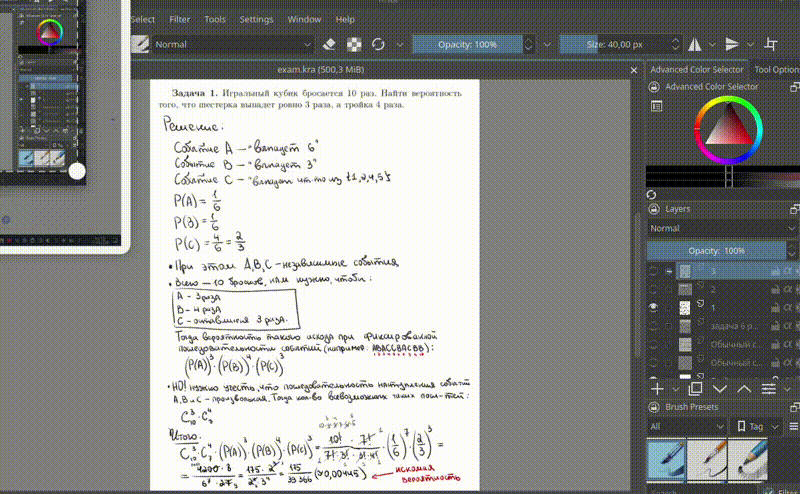

# Krita plugin: Export Layers to PDF

Данный плагин реализует автоматизированную выборку и упорядочивание слоёв документа .kra на основе именования слоёв непрерывной последовательностью натуральных чисел `1, 2,..., n` (где `n` - число учитываемых плагином слоёв), после чего экспортрует каждый из таких слоёв в **.png** файл и объединяет их в единый **PDF** файл.

## Setup

#### 1. Выполнить в командной строке:

```
git clone https://github.com/MigunovaAnastasia1/layers2pdf.git
cd layers2pdf
chmod +x install.sh
./install.sh
```
#### 2. Затем в Krita выполнить:

1. Перезапустить _Krita_, если она была открыта
2. В панеле Krita перейти в **Settings → Configure Krita → Python Plugins Manager**
3. В открытом спике плагинов выбрать плагин **"Export Layers to PDF"**
4. Перезапустить Krita

#### Проверка корректности установки:
Для проверки корректности проведенной установки в панели Krita перейти в Tools → Scripts. Если в спике плагинов отображается "Export Layers to PDF", то установка прошла успешно

## How to use

###### **Подразумевается, что к этому этому моменту уже был выполнен этап [Setup](#setup).

Пошаговая инструкция использования плагина **Export Layers to PDF**:

* Открыть в редакторе Krita документ **.kra**, слои которого необходимо конвертировать в единый **PDF**. При этом окрытый документ должен быть сохранен на диске.
* Изменить наименования слоев, которые необходимо включить в итоговый **PDF** файл, в соответсвии с следующими правилами:
  * имя файла = порядковый номер в итоговом **PDF** файле
  * имена слоев, которые попадут в итоговый **PDF** файл, должны составлять непрерывную последовательность натуральных чисел `1, 2,..., n` (где `n` - число страниц в итоговом **PDF** файле)
  * слои, не именнованые указнным ранее образом, не будут входить в итоговый **PDF** файл. То есть если есть черновые слои, которые не хотелось бы учитывать при сборке итогового **PDF** файла, то плагин даёт возможность их игнорировать, при этом не удаляя их из данного документа **.kra**
* В панеле Krita перейти в **Tools → Scripts → Export Layers to PDF**

## 🎬 How it works

При выполнении всех предшествующих шагов раздела [How to use](#), а также корректного выполнения этапа [Setup](#setup), работа плагина будет выглядеть примерно следующим образом:




## Tested environment

Плагин гарантированно работает в следующих условиях:
| Component | Version |
|-----------|---------|
| **OS** | Ubuntu 25.10 (Linux) |
| **Krita** | 5.2.13 |
| **Python** | 3.13.7 |

> ⚠️ На других системах (включая Windows, macOS и другие дистрибутивы Linux) плагин не тестировался.

## License

MIT
